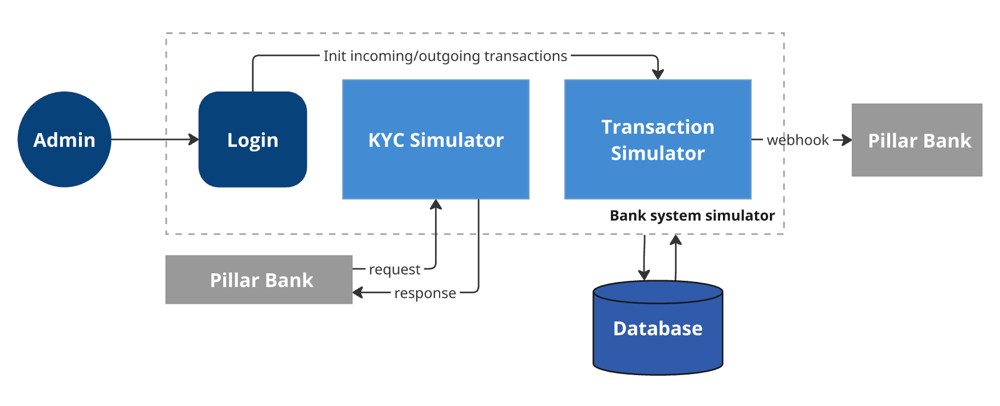

# Bank System Simulator - backend

The Bank Simulator is a mock banking backend used to support the functionality of [Pillar Bank](https://github.com/artengin/Pillar-bank-laravel). It handles KYC verification and simulates financial transactions, enabling realistic integration and testing.  
[](https://github.com/artengin/Bank-simulator-laravel/actions)  

## Project Setup
```
docker compose up --build
```

Set the following values in .env and .env.testing:  

```
WEBHOOK_TRANSACTION_PILLARBANK_URL=
WEBHOOK_TRANSACTION_TOKEN_PILLARBANK_SECRET=
KYC_SECRET_KEY=
```

WEBHOOK_TRANSACTION_PILLARBANK_URL: [Pillar Bank](https://github.com/artengin/Pillar-bank-laravel)

## Features  

### 🔐 Admin Authentication  

- Admin login using JWT authentication  
`POST /login`  


### ✅ KYC Verification  

- Verifies user identity by Social Security Number (SSN) 

- Saves KYC result to the database  
`POST /kyc`  


### 💸 Transactions Simulation  

- Simulate incoming or outgoing transactions  

    - Saves transaction data to the database  

    - Retrieving a list of transactions for the authenticated user  
`POST /transactions/{transaction_type}`
  

### 📘 API Documentation  

- Automatic API documentation generation  
Powered by ronasit/laravel-swagger  

  

